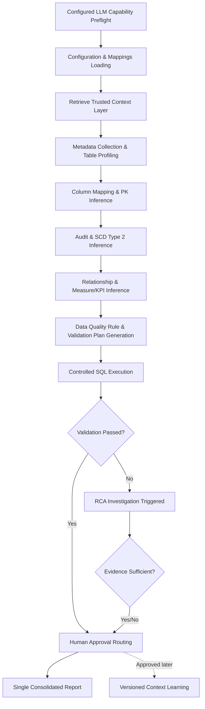
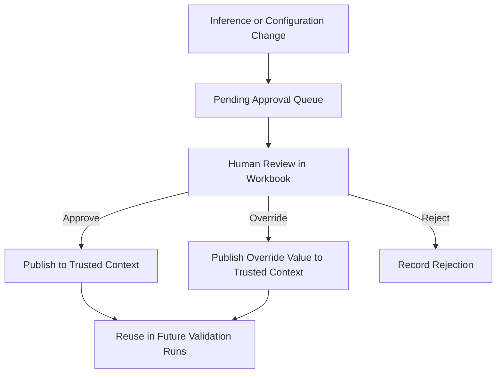
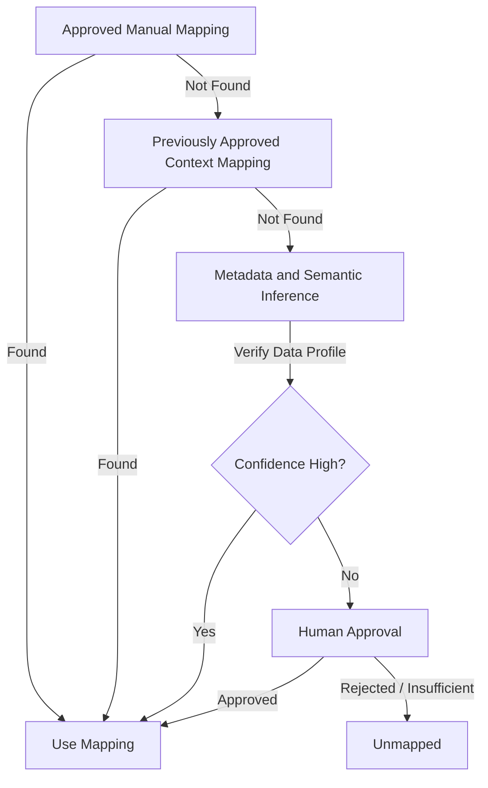
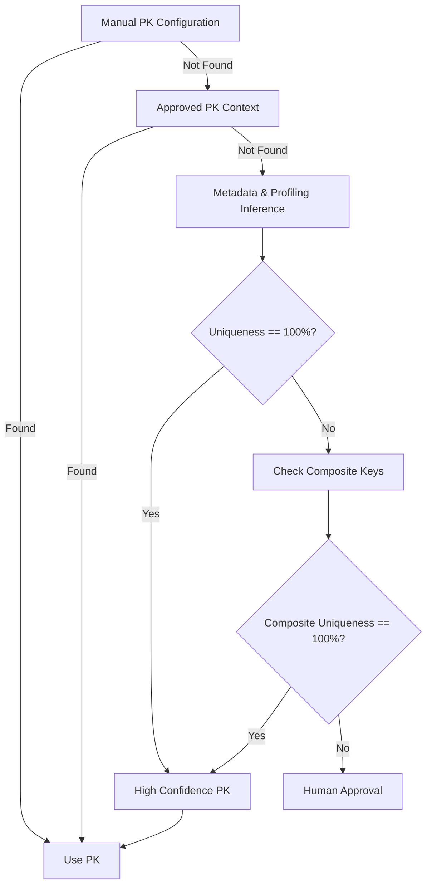
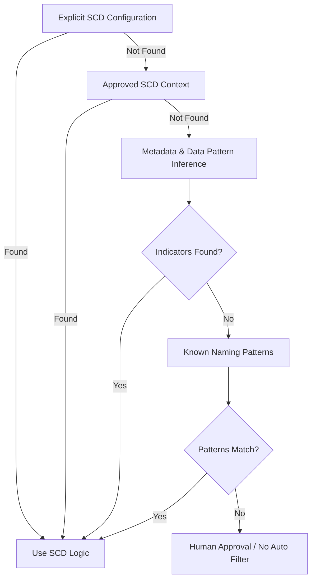
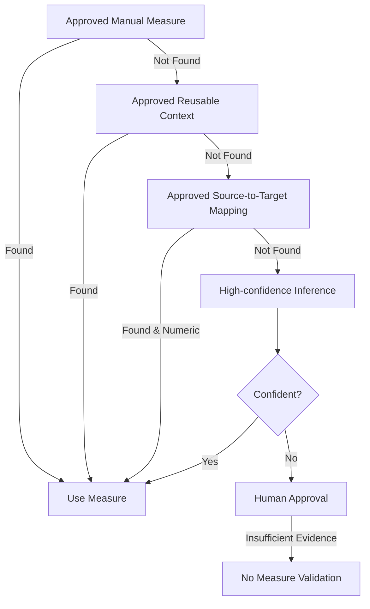
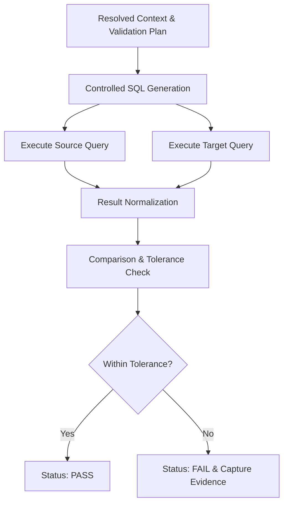
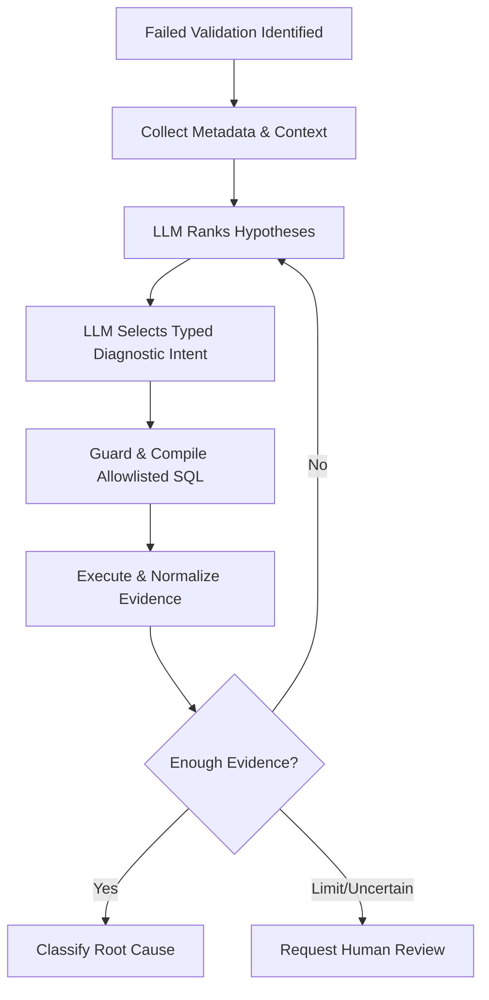
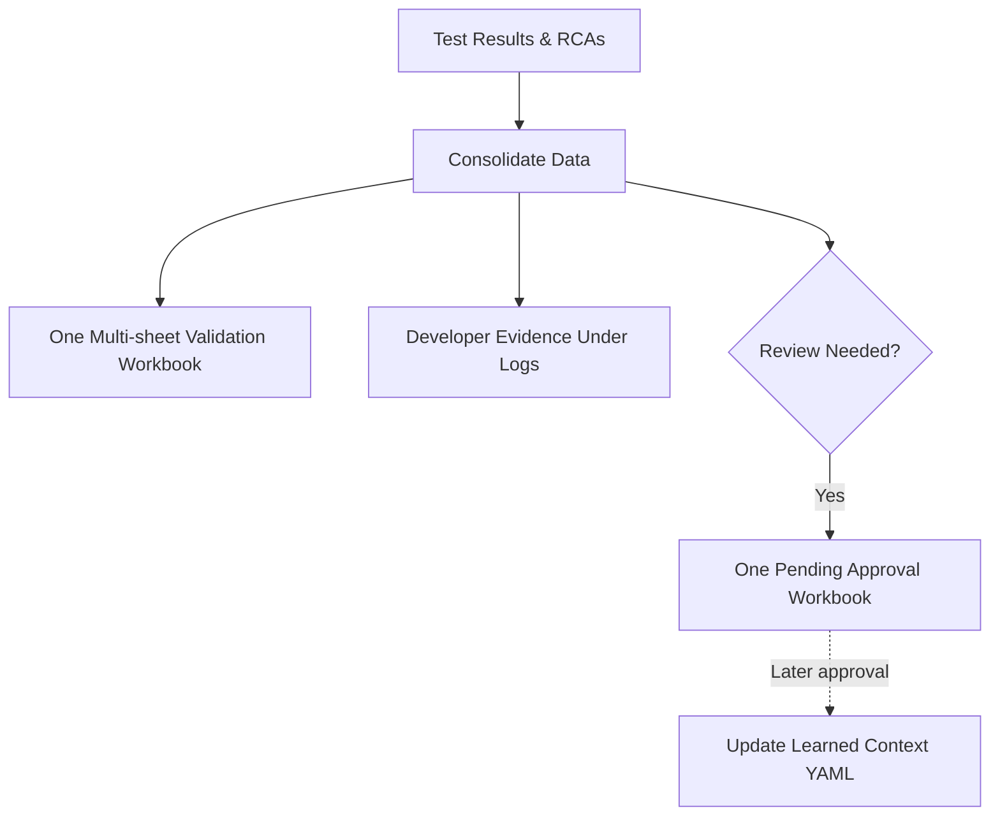

# Data Quality Agent: End-to-End Conceptual Flow

## 1. High-level solution overview

The Data Quality Agent is a conceptual validation framework designed to assure data consistency and quality during Databricks-to-BigQuery migrations, as well as for ongoing BigQuery-only data quality monitoring. Its design centers around deterministic execution, business context awareness, and an evidence-based feedback loop with human reviewers.

Unlike systems that blindly trust AI to generate unrestricted SQL or arbitrary validation rules, this agent uses a controlled methodology. It dynamically infers mappings, keys, rules, and relationships, but strictly controls how these inferences are executed and demands explicit human approval for uncertain or high-impact decisions. Once approved, this knowledge is stored in a persistent "Context Layer" so the agent becomes progressively smarter over time without repeating the same questions.

The entire process operates through a series of logical stages: input loading, metadata extraction, context-aware inference, controlled rule execution, root-cause analysis (RCA) for failures, human approval routing, and consolidated reporting.

---

## 2. Complete end-to-end conceptual flow

The following flowchart illustrates the high-level trajectory of the entire validation process.

---

## 3. Stage-by-stage detailed explanation

### 1. Validation initiation

A validation run begins with a mandatory capability check for the configured LLM backend, model, endpoint, and structured-output support. This happens before any warehouse access. The agent then reads enabled table pairs from `table_mappings.xlsx` and can process multiple pairs in one batch.

*   **Databricks-to-BigQuery migration mode:** The agent expects both source (Databricks) and target (BigQuery) coordinates. It compares structural schema, row counts, and detailed data points between the two systems.
*   **BigQuery-only mode:** The agent skips the source comparison and focuses solely on target-side data quality rules, profiling, and referential integrity against other BigQuery tables.
*   **Offline verification:** Existing sample metadata supports configuration, retrieval, planning, SQL-compilation, and notebook smoke checks without warehouse access.
*   **Configuration:** `llm.yaml` selects a provider and model without application changes. Project and pair configuration determine inference and query limits; agent reasoning is not silently replaced when the LLM is unavailable.

### 2. Configuration and input loading

The agent loads and merges various inputs to build its foundation before touching any database. Information is ingested from:
*   Table mappings and Column mappings
*   Business context (table descriptions, rules) and Business filters
*   Explicit Primary-key, Audit-column, and SCD Type 2 configurations
*   The centralized Dimension registry
*   Custom table relationships and Measure/KPI definitions
*   Human-added test cases

**Precedence Order:** Explicitly provided configuration always overrides automatically inferred or historically approved context. If a user defines a primary key in `context_layer/tables.yaml`, the agent uses it over previous learned context or metadata inference.

### 3. Persistent context layer setup and retrieval

Versioned YAML is the canonical context layer. A rebuildable local SQLite database supplies indexed records, FTS5 lexical search, and relationship edges for the POC.

*   **What is stored:** Mappings, primary keys, SCD behaviors, relationships, measures, and RCA learnings.
*   **Separation of trust:** Trusted context is active and approved. Pending or rejected proposals are isolated and never influence current validation reasoning.
*   **Retrieval:** Exact pair/table/column matches, relationship neighbors, lexical relevance, schema overlap, approval state, and trust weights are combined into a bounded context package. Every item carries a provenance ID used in reasoning and audit evidence.
*   **Reuse:** If `fact_sales` was previously validated and a human approved that `transaction_date` is the audit column, the agent immediately reuses this fact without needing re-inference.
*   **Replaceability:** Workflow code depends on `ContextRetriever`, so a semantic sidecar such as ChromaDB or Vertex AI Vector Search can later be added without replacing the YAML source of truth.

### 4. Metadata collection and table understanding

The agent queries the data warehouses for schema definitions and profiling statistics:
*   Table/Column names, data types, null percentages, distinct counts, sample values, and freshness metadata.

Using this metadata combined with retrieved context, the agent classifies the table's likely role (e.g., Fact, Dimension, Bridge, SCD Type 2). For example, a table with a high number of numeric metrics and foreign keys is classified as a Fact, whereas a table with unique string codes and descriptors is likely a Reference or Dimension table.

### 5. Column mapping resolution

Column mappings bridge the gap between Databricks and BigQuery schemas.

*   **Manual mapping available:** Explicit mappings are validated against actual table metadata. If valid, they take absolute priority. If missing or invalid, an error is raised for that column.
*   **Manual mapping missing:** The agent generates candidates using name similarity, data type compatibility, descriptions, sample values, and organizational patterns.
*   **Confidence:** A confidence score is computed. High confidence mappings are automatically accepted. Ambiguous mappings are sent to human approval. If evidence is totally insufficient, the column remains unmapped.

### 6. Primary-key identification

Keys must be identified to perform precise row-level comparisons and referential checks.

*   The agent looks for `id`, `sid`, `key`, or `code` suffixes.
*   It profiles the columns to check for 100% uniqueness and zero nulls.
*   If no single column works, it infers composite keys by profiling column combinations.

**Fallback Order:** Explicit Manual Configuration → Approved Key Context → High-Confidence Metadata Inference → Human Approval → Unresolved (Fails if required for validation).

### 7. Audit and freshness-column identification

Audit columns are essential for comparing data freshness. Databricks and BigQuery might use different audit columns for the exact same conceptual table.

1.  Use manual configuration if provided.
2.  Retrieve side-specific approved context (e.g., Databricks uses `source_updated_ts`, BigQuery uses `bq_load_ts`).
3.  Ensure the column exists and is a valid timestamp.
4.  Rank based on frequency of updates and predefined naming patterns (`updated_at`, `insert_ts`).
5.  If no column is found, attempt to use table-level refresh metadata.
6.  If still unresolved, mark freshness as waiting for approval or skipped.

### 8. SCD Type 2 detection and active-record resolution

For Slowly Changing Dimensions (SCD Type 2), the agent needs to know how to filter for the "current" active record.

*   **Detection Evidence:** Presence of `effective_start_date`, `valid_to`, `is_active_flag`, or open-ended expiry dates (e.g., `9999-12-31`).
*   **Active-Record Logic:** If inferred, the agent constructs filters (e.g., `is_active_flag = TRUE`). These are combined logically with any explicit business filters provided (e.g., `source_system = 'BRANDING'`).

### 9. Relationship discovery and referential integrity planning

Relationships are mapped to test if foreign keys correctly resolve to dimension tables.

*   **Centralized registry:** Common dimensions (e.g., `dim_brand`) are registered. If the current table has a `brand_sid`, it's automatically linked to `dim_brand`.
*   **Custom and Context:** Custom relationships and historically approved relationships override the registry.
*   **Automatic inference:** The agent uses column descriptions, key uniqueness, and overlap profiling to guess new relationships. To prevent chaotic joins, it applies strict safeguards (e.g., checking data types and parent-key uniqueness).

**Fallback Order:** Approved Custom Relationship → Centralized Registry → Approved Context → High-Confidence Inference → Human Approval → No Check.

### 10. Measure and KPI resolution

Measures (e.g., `sales_amount`) are numerical values that should be aggregated and compared.

*   The agent identifies measures by avoiding identifiers, years, flags, and sequence numbers.
*   It looks for terms like "amount", "revenue", "qty" and verifies numeric data types.
*   It aggregates them (e.g., `SUM(sales_amount)`) grouped by discovered dimensions.

### 11. Data quality rule generation

With the table fully understood, the agent generates a Validation Plan.

*   **Generic checks:** Row counts, null checks, uniqueness, freshness.
*   **Context-aware checks:** SCD active-record validations, referential integrity against dimensions, measure reconciliations.
*   **LLM-generated business rules:** The LLM is used to dynamically infer context-specific business rules that go beyond standard metrics.
*   **Human-added tests:** Appended directly into the validation plan.

Each rule explicitly records its source, confidence, and whether human approval is required. Context prevents the agent from running generic, useless rules (e.g., it won't check uniqueness on a known non-key column).

### 12. Validation execution flow

The plan is converted into safe, read-only SQL queries.

*   Unrestricted LLM SQL generation is strictly prohibited. The agent uses Python-based parameterized SQL templates.
*   Source and target queries run concurrently. Results are normalized (e.g., handling decimal precision differences) and compared against configurable tolerances.
*   Failures trigger immediate evidence capture.

### 13. RCA trigger and investigation flow

When a test fails, an explicit, bounded RCA investigation state is created.

1.  Retrieve relevant business context and register the original validation evidence.
2.  Ask the LLM to rank hypotheses and select the next typed diagnostic intent.
3.  Validate the intent, identifiers, approved relationships, remaining query budget, and duplicate-step history.
4.  Compile SQL from an allowlisted diagnostic template; the LLM never supplies executable SQL.
5.  Enforce read-only parsing, BigQuery dry-run byte limits, timeouts, row/group limits, and approved table scope.
6.  Execute source/target diagnostics and normalize the result into a new evidence record.
7.  Return evidence to the LLM to conclude, continue, or request human review.
8.  Stop on a supported conclusion, maximum depth/cost, repeated action, or need for human judgment.

### 14. Evidence-aware RCA classification

The agent classifies its RCA findings to prevent hallucinated conclusions:
*   **Confirmed:** Direct evidence proves the explanation.
*   **Likely:** Multiple observations make the explanation probable, but not proven.
*   **Possible:** Evidence is suggestive but incomplete.
*   **Undetermined:** The budget was exhausted, the intent was unsafe or unsupported, or evidence remained insufficient.

### 15. Human approval and context-learning flow

Any decision lacking high deterministic confidence (mappings, keys, new measures, RCA learnings) is packaged into an approval payload.

*   Workbooks move through folders: `pending` → `reviewed` → `processed` → `archive`.
*   Only rows explicitly marked `APPROVE` or `OVERRIDE` are written to `context_layer/learned_context.yaml`; rejected rows never influence retrieval.

### 16. Reporting flow

The run concludes with exactly one user-facing workbook at `outputs/<run_id>/dq_validation_report.xlsx`.

*   Its sheets cover summary, tables, mappings, schema, counts, freshness, profiles, business rules, human tests, relationships, measures, RCA, failures, approvals, and errors.
*   SQL, diagnostic evidence, manifests, events, checkpoints, and developer logs remain under `logs/<run_id>/`.
*   At most one review workbook is created per run under `approvals/pending/`.

---

## Fallback and precedence summary

Throughout the agent, the golden rule of precedence applies strictly:

1.  **Explicit User Configuration:** (e.g., `context_layer/tables.yaml`, `column_mappings.xlsx`) is absolute truth.
2.  **Approved Trusted Context:** Versioned configured knowledge and past human approvals retrieved through the local index.
3.  **High-Confidence Deterministic Inference:** Data profiling, registry matches, and metadata rules with strict thresholds.
4.  **Human Approval:** If confidence is low, execution pauses for the specific decision.
5.  **Unresolved/Skipped:** If entirely incapable of finding an answer, the specific rule or validation is skipped gracefully without crashing the whole table process.

## Human-approval decision summary

Human approval is required for:
*   Ambiguous column mappings
*   Primary keys without 100% distinctness profiles
*   Uncertain audit columns or complex SCD2 behaviors
*   Fuzzy relationship matches not in the central registry
*   New, unverified measures/KPIs
*   Promoting RCA conclusions into reusable global rules
*   Custom LLM-generated business rules

By following this controlled flow, the Data Quality Agent ensures scalability, safety, and continuous learning without sacrificing governance or deterministic reliability.
